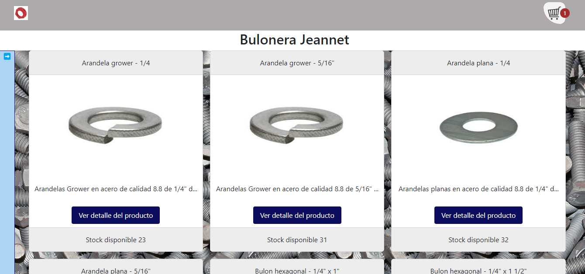
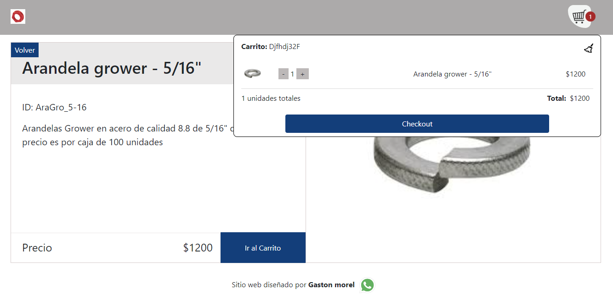
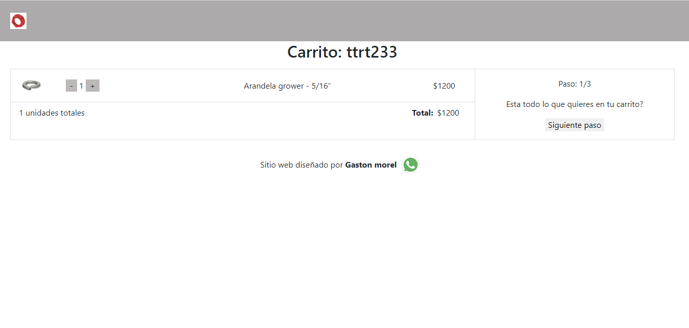
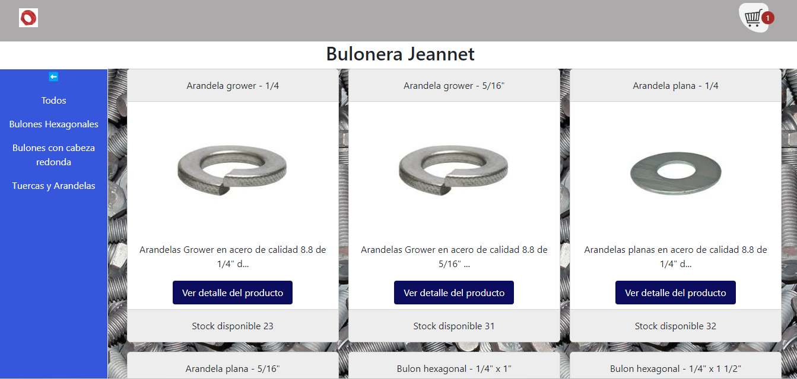
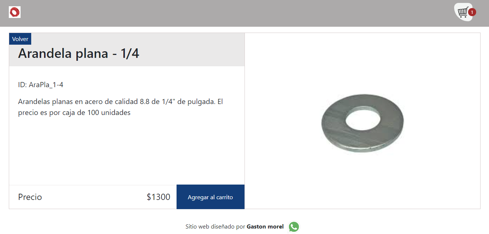
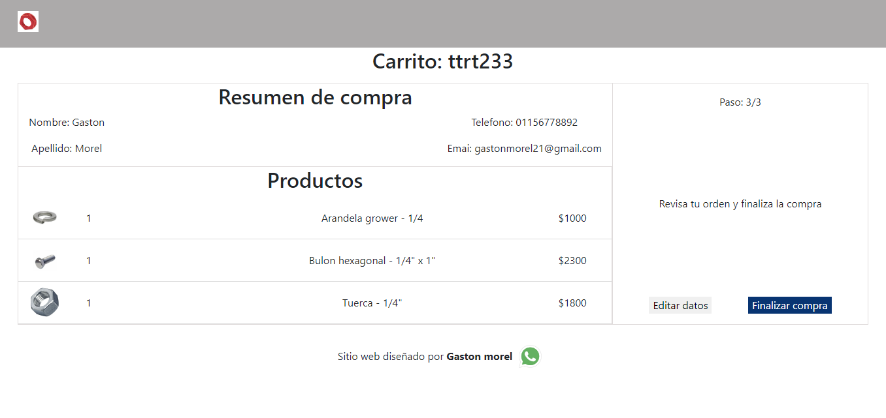

# Bulonera Jeannet

El presente proyecto implica un E-commerce para una bolunera y fue realizado a modo de trabajo final en el marco del curso de React dictado por el profesor Félix Blanco desde la comisión 34825 de la plataforma educativa Coderhouse.

## Ejecutar localmente

Para poder ejecutar el código se debe correr el siguiente comando:

- npm start

Descargado el mismo se deben usar los siguientes comandos:

- npm i
- npm start

## Listado de tecnologias usadas

- React
- ReactDOM
- BrowserRouter y routes (con Link desde react-router-rom)
- Provider
- Extensión JSX de Javascript
- Create-react-app
- Componentes
    - Componentes contenedores
    - Componentes basados en funciones
    - Componentes presentaciónales
    
- Hooks (llamados desde)
    - useState, useEffect, useContext, useRef (react)
    - useNavigate, useLocation, useParams (react-router-dom)
    - useCart, useCartActions, useCartSelectors, useUiActions, useUiState, useLocation, useGetSingleProduct (definidas desde los componentes del proyecto y exportadas a otros componentes)

- Promesas y Asincronia (con await en order.context, product.context, OrderPage y CartPage)
- Metodo Map (en ItemDisplay, OrderDisplay, CartMenu, cart.context, HomePage y OrderPage)
- Fetch (en order.context, product.context y OrderPage)
- Eventos (en FormDisplay, ItemRow, cart.context, product.context, CartPage y HomePage)
- Context con Provider (cart.context, order.context, product.context y ui.context)
- Renderizado condicional (en CartPage, HomePage y ItemPage)
- Firebase (se adjunta captura de la colección a fin de poder verificar la forma en que se encuentran estructurados los datos)

<aside>
💡 Respecto de Firebase cabe destacar que si bien se podian asignar los ID de cada documento de manera dinámica opté por definirlos de manera manual a fin de que resulte mas clara la carga de datos y que tenga una lógica descriptiva del contenido de cada producto. También se creó un campo “categoria” a fin de filtrar las mismas desde el archivo categories de la carpeta data.

</aside>

## Rubricas

              

> *El presente proyecto conforme lo solicitado permite al usuario navegar por los productos e ir a sus detalles donde se describe el mismo, se visualiza su foto y se da la opción de ingresarlo al carrito para poder visualizar un listado compacto desde el que se puede sumar o restar unidades a cada producto agregado y se elimina cada producto al restar unidades hasta llegar a cero.*
> 

> *Al efectuar el checkout del carrito ya sea desde la visualización compacta del carrito o accediendo desde la selección de un producto nuevo se pregunta al usuario si ya tiene todo lo que desea en cuyo caso desde la opción siguiente paso se accede al formulario donde se solicita los datos personales y se verifica que esten completos asi como se verifica que el correo coincida (esto a través del archivo validations que se exporta a la page CartPage) para luego guardar la orden y devolver un feeback con su número.*
> 

### Conforme lo recomendado se incluyeron los siguientes componentes

- NavBar
- CartWidget
- ItemListContainer
- ItemList
- ItemDetail (ItemCard)
    - ItemQuantitySelector (en ItemRow y cart.context)
    - Description (en ItemCard y en product.context como aviso cuando no existe el producto)
    - AddItemButton (AddItemToCart en ItemPage y cart.context)
- Checkout
    - Brief (en CartMenu, cart.context y CartPage)

### Requisitos mandatorios

- **Inicio:**
    
      
    
    Al momento de ingresar a la app se puede visualizar
    
    - La totalidad de los productos del stock
    
    
    
    - se puede visualizar el logo del carrito en la parte superior derecha desde el que se puede acceder a una vista compacta de los productos agregados o bien se da un feedback donde se avisa que el carrito está vacio. El carrito se encuentra alojado en la ruta /cart y se accede al mismo ya sea desde el boton checkout desde la vista compacta del carrito o bien desde el boton ir al carrito que aparece en la vista del detalle de un producto cuando este es agregado
    
    
    
    
    
    - hay una sidebar del lado izquierdo que al desplegarse mediante un boton con forma de flecha permite volver a cerrarla mediante otra flecha, y filtra una vista por categoria o bien mostrando todos los productos
    
    
    
- **Flow:**
    
    
    - Al momento de clickear sobre un producto la ruta /item/:id (cabe destacar nuevamente que los id de cada producto no fueron generados en forma dinámica sino manualmente a fin de que sean mas descriptivos)
    
    
    
- **Firebase:**
    - Se implementaron dos colecciones siendo la una generada mediante carga manual de datos (**productos**) y la otra generada desde la app mediante las compras realizadas (**orders**). Cabe destacar que los ID tal como se indicó mas arriba se asignaron a los documentos de la colección productos de manera manual a fin de que sean mas descriptivos y resulten mas facil de organizar su carga y manejo desde firebase
    - items:
        - Las fotos de los productos para firebase se incluyeron mediante una ruta a fotos disponible en internet
        - El precio unitario se incluyó como campo “price”
        - La descriptión “description” en firebase se visualiza solo de manera parcial viéndose en forma completa recién al ingresar al detalle del producto
        
    - orders: permiten el registro de la compra de mas de un item de distintas categorias

    

    - el cart resulta accesible desde toda la experiencia y con cada producto nuevo agregado se visualiza como se incrementa la cantidad de productos distintos. Ingresando a la versión compacta del carrito desde el icono del mismo se puede ver la cantidad de pruductos de cada tipo y se realizó un reduce para obtener el precio total del carrito.

- **Checkout:**
    
    
    Al realizar el checkout , donde se visualiza la cantidad seleccionada de cada producto con sus botines para incrementar o reducir los mismos y se puede ver el precio total de la orden, se pregunta al ususario si quiere agregar mas productos y en el siguiente paso se lo invita a llenar el formulario donde se requiere
    
    - Nombre, apellido y teléfono (que se verifica estén completos) así como e-mail (que se verifica que esté completo y que se ingrese una segunda vez en forma idéntica a la anterior)
    - Finalmente se realiza una devolución al usuario con los datos de la compra y del ID generado en forma dinámica que incrementará la colección orders en firebase.

<aside>
              
    Gracias por leer hasta el final! Que tenga un buen dia!

</aside>

